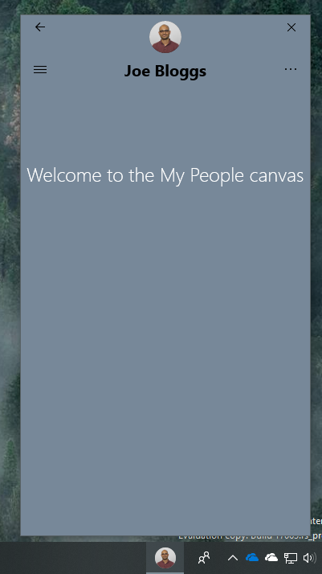
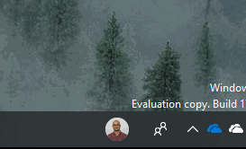
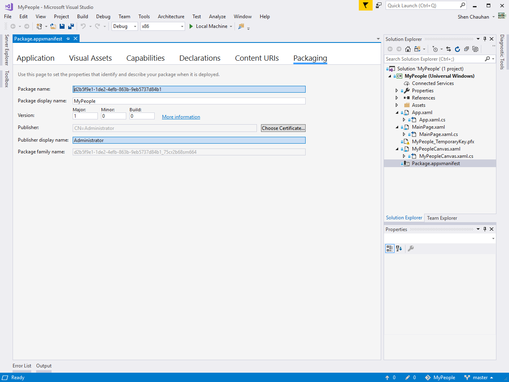
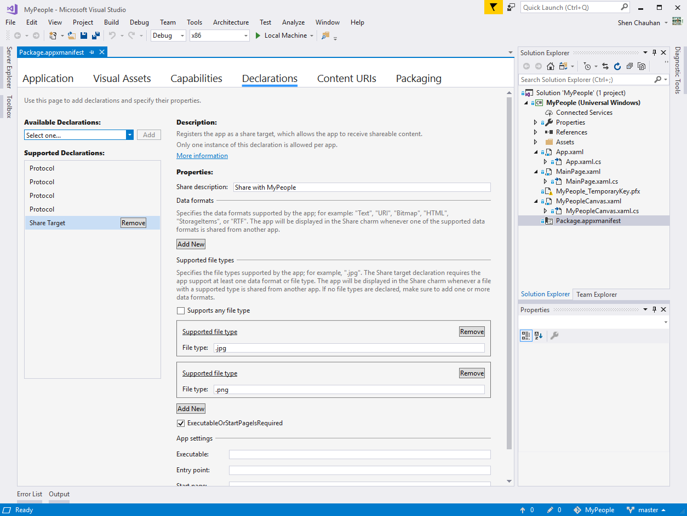
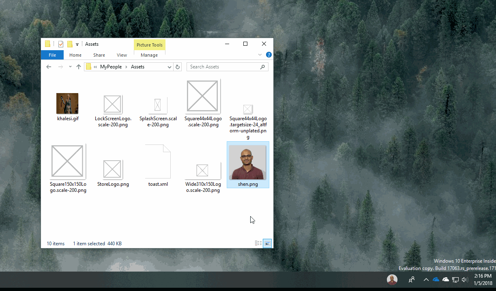

# My People

## Introduction
One of my new favourite features in Windows is: My People. My People makes it easy to stay connected with contacts you often engage with. My People gives users the ability to pin their favourite contact to the task bar. Users can interact with their contact through voice, video, and text from the task bar. This makes it quick and easy to use without distracting your flow. 



For responses requiring an emoticon, My People has shoulder tap, a simple notification above the contact. 



I want to show you how you can use My People in your applications to drive better engagement.

## Phases of development
* Setup Protocol Activation for MyPeople experiences
* Create a Contact (optional)
* Annontate a contact
* Pin a Contact
* Shoulder Tap
* Sharing content as a share target
* Passing Contact Information

Here I have my UWP, it's nothing too glamourous since it's for demo purposes. I have a MainPage which has a welcome message, a create contact button and a should tap button. 


When I click the Create Contact button, it will create a contact called [Joe Bloggs](https://en.wikipedia.org/wiki/Joe_Bloggs), he is a good looking guy :) and pin Joe to the task bar. 

When I click the "Shoulder Tap" Button it plays an animation above Joe's head.

When I click on the contact, you'll see the My People app show in the tab and display a different UI that is suited to it's space. When I drag content to the contact, it shares that content.

Now you know what's possible, let's get into the code!

When you launch the My People app from the task bar, it loads a seperate instace of your application. I could use the Visual State Manager to change the look on the MainPage. In this case, I decided to create a seperate XAML file. When lauching the app from the task bar, we need to override the OnActivated method in the App.xaml.cs


### Setup Protocol Activation for MyPeople experiences
```csharp
override protected void OnActivated(IActivatedEventArgs e)
{
    if (e.Kind == ActivationKind.ContactPanel)
    {
        var args = e as ContactPanelActivatedEventArgs;
     
        // Change Contact Panel Header Color.
        args.ContactPanel.HeaderColor = Colors.LightSlateGray;
        
        // Create a Frame to act as the navigation context and navigate to the first page
        var rootFrame = new Frame();

        // Place the frame in the current Window
        Window.Current.Content = rootFrame;

        // Navigate to the page that shows the Contact UI.
        rootFrame.Navigate(typeof(MyPeopleCanvas), args);

        // Ensure the current window is active
        Window.Current.Activate();
    }
}
```
In this code you can see that when the activation is from the contact panel. I setup the root frame to navigate to the MyPeopleCanvas XAML. If you have done protocol activation before, this code should look familar. Optionally, you can change the header color to keep in line with your app brandning, so I've set mine to Light Slate Gray.

Now that I have the page and routing setup, it's time to integrate our experience with My People.

### Integrate with My People

In this demo, I am going to create a contact. This is optional if you already have a contact. I want to show you how to create a contact though as some application developers may have bots. This is a really nice way to show your bot some love and increase their user engagement.

First step is to add the extension for contact panel to the app. Open the Package.appxmanifest in the code editor and add these lines of XML. Note you'll need to also add a new namespace if you don't already have uap4 specified.

```xml
<uap4:Extension Category="windows.contactPanel">
    <uap4:ContactPanel SupportsUnknownContacts="true" />
</uap4:Extension>
```

There are 4 main concepts that happen when I click the Create Contact button:
* Find a contact (in case it already exists)
* If the contact doesn't exist, create one
* Annotate the contact so My People knows what this contact can do.
* Programmatically pin the contact to the task bar

```csharp
private async void CreateContact_Click(object sender, RoutedEventArgs e)
{
    var contact = await FindContact("joebloggs@contoso.com");

    if (contact == null)
    {
        await CreateAContact();
        contact = await FindContact("joebloggs@contoso.com");
    }

    await TagAContact(contact);
    await PinAContact(contact);
}
```

Based on the steps above, let's start creating the methods. 

I need to first find a contact. If the contact already exists then there is no point re-creating it. I use the ContactManager to request the Contact Store, basically all my contacts on the device. I then ask it to find a contact with an id (in this case Joe Bloggs email address). If it finds Joe, return him, otherwise return null.

```csharp
private async Task<Contact> FindContact(string id)
{
    ContactStore contactStore = await ContactManager.RequestStoreAsync();
    IReadOnlyList<Contact> contacts = null;
    contacts = await contactStore.FindContactsAsync(id);
    return contacts.FirstOrDefault();
}
```

I'm guessing most of you won't have Joe Bloggs on your machine already, so I'm going to create a contact, with an image, email and phone number. The remote id is a unique id for the contact. It syncs with the user across their devices. I use an email address for the remote id because they are generally pretty unique. Once I have created a contact, I need to add it to a Contact List. Contacts don't generally float around, they are part of a list. You can see the various lists you have in the Windows 10 People app (not to be confused with this app). Once I find or create a Contact List, I save the contact to it.

```csharp
private async Task CreateAContact()
{
    var contact = new Contact
    {
        FirstName = "Joe",
        LastName = "Bloggs",
        SourceDisplayPicture = RandomAccessStreamReference.CreateFromUri(new Uri("ms-appx:///Assets/shen.png")),
        RemoteId = "joebloggs@contoso.com"
    };

    var email = new ContactEmail
    {
        Address = "joebloggs@contoso.com",
        Kind = ContactEmailKind.Other
    };

    contact.Emails.Add(email);

    var phone = new ContactPhone
    {
        Number = "1234567890",
        Kind = ContactPhoneKind.Mobile
    };

    contact.Phones.Add(phone);

    var store = await ContactManager.RequestStoreAsync(ContactStoreAccessType.AppContactsReadWrite);

    ContactList contactList;
    IReadOnlyList<ContactList> contactLists = await store.FindContactListsAsync();

    if (!contactLists.Any())
    {
        contactList = await store.CreateContactListAsync("MyPeopleContactList");
    }
    else
    {
        contactList = contactLists.First();
    }

    await contactList.SaveContactAsync(contact);
}
```
        
A contact on it's own is no good though, what we need to do is annotate the contact so we can associate our app to it. We need to apply the supported operations our app can help with. To do this we create a ContactAnnotation.  

### Annontate a contact
```csharp
private async Task TagAContact(Contact contact)
{
    ContactAnnotationStore annotationStore = await ContactManager.RequestAnnotationStoreAsync(ContactAnnotationStoreAccessType.AppAnnotationsReadWrite);
    ContactAnnotationList annotationList;
    IReadOnlyList<ContactAnnotationList> annotationLists = await annotationStore.FindAnnotationListsAsync();

    if (!annotationLists.Any())
    {
        annotationList = await annotationStore.CreateAnnotationListAsync();
    }
    else
    {
        annotationList = annotationLists.First();   
    }

    var annotation = new ContactAnnotation
    {
        ContactId = contact.Id,
        RemoteId = "joebloggs@contoso.com",
        SupportedOperations =
        ContactAnnotationOperations.AudioCall |
        ContactAnnotationOperations.VideoCall |
        ContactAnnotationOperations.ContactProfile |
        ContactAnnotationOperations.Share | ContactAnnotationOperations.Message
    };
    string appId = "d2b5f9e1-1de2-4efb-863b-9eb5737d84b1_75cr2b68sm664!App";
    annotation.ProviderProperties.Add("ContactPanelAppID", appId);
    annotation.ProviderProperties.Add("ContactShareAppID", appId);

    await annotationList.TrySaveAnnotationAsync(annotation);
}
```
The ContactAnnotation must share the same contact id and remote id of the contact. This helps join the annontation to the contact. I also register the contact annotation with the Contact Panel (task bar) and the share target. To register, I set the ProviderProperties with the AppId. You can get the app id from the Package.appxmanifest, navigate to the packaging tab. Copy the Package Family Name and append "!App" to it.



As I'm registering various operations, I need to also make sure I have access to them so I select them as Capabilities:


The final thing we want to do is programmatically pin the contact to the My People contact panel. This step is optional but I wanted to show you how easy it is to programmatically do this.
### Pin a Contact
```csharp
private async Task PinAContact(Contact contact)
{
    PinnedContactManager pinnedContactManager = PinnedContactManager.GetDefault();
    await pinnedContactManager.RequestPinContactAsync(contact, PinnedContactSurface.Taskbar);
}
```

Let's run the app up and see what happens.


WAHOO!! So we have the basics. Let's now add the optional extras. 

Next is the shoulder tap. When someone taps the "Shoulder Tap" button I want ot play an animation above the contact. I'm a Game of Thrones fan, so I'm going to pick my favourite gif of [Daenerys Targaryen](https://en.wikipedia.org/wiki/Daenerys_Targaryen).


What's great about the shoulder tap is that it uses the Toast Nofication infrastruction. I pass the shoulder tap xml payload to ToastNotificationManager.
### Shoulder Tap
```csharp
private void ShoulderTap_Click(object sender, RoutedEventArgs e)
{
    string xmlText = File.ReadAllText(@"Assets\toast.xml");
    XmlDocument xmlContent = new XmlDocument();
    xmlContent.LoadXml(xmlText);

    var notification = new ToastNotification(xmlContent);
    ToastNotificationManager.CreateToastNotifier().Show(notification);
}
```

How does the ToastNotificationManager know that this is a shoulder tap vs a generic toast? Well... In the payload we set the attribute experienceType="shoulderTap". If the user is not pinned, it will show a toast noification based on the first template ("Oh no, pin me!". If the contact is pinned to the My People Contact Panel then it will use the second template and do the shoulder tap.

```xml
<toast hint-people="remoteid:joebloggs@contoso.com">
  <visual lang="en-US">
    <binding template="ToastGeneric">
      <text hint-style="body">Oh no, pin me!</text>
      <text>MyPeople sent you a notification</text>
    </binding>

    <binding template="ToastGeneric" experienceType="shoulderTap">
      <image src="ms-appx:///Assets/khalesi.gif"/>
    </binding>
  </visual>
</toast>
```

For my final My People feature I'm going to add a Share Target. This is great if you want to pass files to someone quickly. If it's a bot maybe dragging an image over the bot contact will perform an image search. The ideas are endless.

In the App.xaml.cs I override the OnShareTargetActivated method. If the share was performed against a contact I want to load the MyPeopleCanvas page, otherwise the MainPage.

### Sharing as a share target
```csharp
protected override void OnShareTargetActivated(ShareTargetActivatedEventArgs args)
{
    bool isPeopleShare = false;
    if (ApiInformation.IsApiContractPresent("Windows.Foundation.UniversalApiContract", 5))
    {
        // Make sure the current OS version includes the My People feature before
        // accessing the ShareOperation.Contacts property
        isPeopleShare = args.ShareOperation.Contacts.Any();
    }

    if (isPeopleShare)
    {
        var rootFrame = new Frame();

        // Place the frame in the current Window
        Window.Current.Content = rootFrame;
        
        // Navigate to the page that shows the Contact UI.
        rootFrame.Navigate(typeof(MyPeopleCanvas), args.ShareOperation);

        // Ensure the current window is active
        Window.Current.Activate();
    }
    else
    {
        // Show standard share UI for unpinned contacts
        var rootFrame = new Frame();

        rootFrame.Navigate(typeof(MainPage), args.ShareOperation);

        // Place the frame in the current Window
        Window.Current.Content = rootFrame;
    }
}
```
In the MyPeopleCanvas page, I check the ShareOperation and extract the contact information and the data. In this case the name and image.
### Passing Contact Information
```csharp
protected async override void OnNavigatedTo(NavigationEventArgs e)
{
    if (e.Parameter is ShareOperation shareTarget)
    {
        WelcomeMessageTextBlock.Text = $"Welcome {shareTarget.Contacts.First().Name}, here is your image";

        if (shareTarget.Data.Contains(StandardDataFormats.StorageItems))
        {
            var storageItems = await shareTarget.Data.GetStorageItemsAsync();
            var storageItem = storageItems.Cast<StorageFile>().First();
            var bitmapImage = new BitmapImage();
            await bitmapImage.SetSourceAsync(await storageItem.OpenReadAsync());
            MyImage.Source = bitmapImage;
        }
    }
}
```
To make sure that only jpg and pngs are sent, I need to declare the Share Target in the Package.appxmanifest.



Now when I drag and image over the contact and drop it, look what happens!



I hope you have enjoyed reading this post. I know it's been a while since I've posted but I plan to blog more often this year! :)

You can find the source here:
https://www.github.com/shenchauhan/MyPeople
